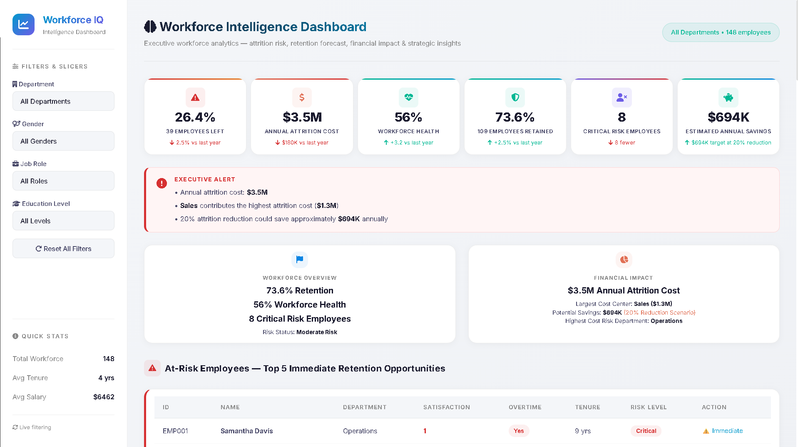

# Employee Attrition & HR Analytics Dashboard

📅 **Workforce Coverage:** 148 Employees

💻 **Interactive Dashboard:** [Live Dashboard (GitHub Pages)](https://girishshenoy16.github.io/employee-attrition-hr-analytics-dashboard)

---



---

> [!IMPORTANT]
>
> ### FY2026 Workforce Stabilization Directives
>
> 1. Reduce **Sales Attrition** from **39.3% → 25%** through targeted retention initiatives.
> 2. Launch a promotion review program for **23 high-performing employees** currently overdue for advancement.
> 3. Reduce overtime dependency within **Operations** and **Support** departments.
> 4. Improve **Workforce Health Score** from **56% → 70%** through engagement and wellbeing initiatives.
> 5. Deploy an **Early Warning Retention Monitoring System** to proactively identify flight-risk employees.

---

# 1. Project Objective

The objective of this project is to build an executive-grade Workforce Intelligence platform that transforms employee attrition data into strategic business insights.

The dashboard simulates the workforce analytics, talent retention, organizational health monitoring, and cost optimization workflows used by HR leaders, CHROs, People Analytics teams, and executive decision-makers.

It enables organizations to identify attrition risks, measure workforce health, forecast retention trends, quantify turnover costs, and prioritize retention investments based on business impact.

---

# 2. Business Problem

Employee attrition remains one of the most expensive hidden costs within modern organizations.

High turnover creates significant challenges:

* Increased recruitment and onboarding expenses
* Productivity losses during transition periods
* Reduced employee morale and engagement
* Knowledge and experience leakage
* Delayed project delivery and operational inefficiencies

Without data-driven workforce intelligence, organizations often react to resignations rather than proactively preventing them.

This project addresses that challenge by transforming workforce data into actionable retention insights.

---

## 3. Enterprise Applications

This solution reflects the same workforce intelligence capabilities used across global enterprises for:

| Area                | Application                                            |
| ------------------- | ------------------------------------------------------ |
| Workforce Analytics | Monitor organizational stability and attrition trends  |
| Talent Management   | Identify high-risk employees before resignation        |
| HR Strategy         | Prioritize retention initiatives by business impact    |
| Workforce Planning  | Forecast workforce requirements and retention outcomes |
| Employee Experience | Monitor workforce health and engagement indicators     |
| Executive Reporting | Deliver board-ready workforce intelligence dashboards  |

### Similar Workforce Analytics Practices Used By

* Accenture
* Deloitte Human Capital
* Infosys
* TCS
* IBM Workforce Analytics
* Microsoft People Analytics
* Google People Operations

---

# 4. Executive Dashboard Architecture

```text
┌───────────────────────────────────────────────┐
│ Executive KPI Layer                           │
│ Attrition • Retention • Cost • Health         │
├───────────────────────────────────────────────┤
│ Executive Intelligence Layer                  │
│ Alerts • Workforce Overview • Financial Impact│
├───────────────────────────────────────────────┤
│ Attrition Drivers Layer                       │
│ Cost Impact • Department Attrition            │
├───────────────────────────────────────────────┤
│ Workforce Drivers & Forecast Layer            │
│ Overtime • Promotion • Trends • Forecast      │
├───────────────────────────────────────────────┤
│ Risk Segmentation Layer                       │
│ At-Risk Employees • Risk Ranking              │
├───────────────────────────────────────────────┤
│ Strategic Action Layer                        │
│ Recommendations • Savings • Timelines         │
└───────────────────────────────────────────────┘
```

---

# 5. Key Performance Indicators (KPIs)

| KPI                     | Formula                           | Strategic Value                        |
| ----------------------- | --------------------------------- | -------------------------------------- |
| Attrition Rate          | Employees Left ÷ Workforce        | Measures workforce instability         |
| Retention Rate          | Employees Retained ÷ Workforce    | Tracks workforce loyalty               |
| Workforce Health Score  | Composite Workforce Index         | Measures organizational wellbeing      |
| Annual Attrition Cost   | Cost of Employee Turnover         | Quantifies financial impact            |
| Critical Risk Employees | Multi-factor Risk Model           | Identifies immediate retention threats |
| Estimated Savings       | Attrition Cost × Reduction Target | Calculates retention ROI               |

---

# 6. Workforce Risk Scoring Methodology

The dashboard uses a weighted multi-factor risk model to identify employees at risk of leaving.

```text
Risk Score Components

30% Satisfaction Score
25% Overtime Exposure
20% Promotion Gap
15% Performance Rating
10% Tenure
```

### Risk Classification

| Risk Score | Classification |
| ---------- | -------------- |
| 13+        | Critical       |
| 11–13      | High           |
| 9–11       | Medium         |
| <9         | Low            |

This model helps HR teams focus retention efforts where they create the highest business value.

---

# 7. Dashboard Features

### Executive Intelligence

* Executive KPI Cards
* Executive Alert Banner
* Workforce Overview Summary
* Financial Impact Summary

### Attrition Analytics

* Attrition Cost by Department
* Attrition Rate by Department
* Department Risk Ranking
* Workforce Health Monitoring

### Workforce Drivers

* Overtime vs Attrition Analysis
* Promotion vs Attrition Analysis
* Monthly Attrition Trend
* Retention Forecast

### Talent Risk Monitoring

* Top 5 At-Risk Employees
* Risk Score Segmentation
* Critical Risk Workforce Identification

### Strategic Decision Support

* Cost Optimization Opportunities
* Workforce Health Recommendations
* Retention Strategy Planning
* Savings Opportunity Analysis

### Interactive Features

* Department Filters
* Cascading Job Role Filters
* Gender Filters
* Education Filters
* Dynamic KPI Updates
* Real-Time Chart Refresh

---

# 8. Executive Insights

### Workforce Health

* Workforce Health Score is currently **56%**, indicating an at-risk organizational environment.
* Workforce wellbeing requires executive attention to prevent future retention challenges.

### Attrition Cost

* Annual employee attrition cost is estimated at **$3.5M**.
* Sales contributes approximately **$1.3M**, representing the largest cost center.

### Attrition Risk

* Only **8 employees (5.4%)** are classified as Critical Risk.
* These employees require immediate retention intervention.

### Department Analysis

* Sales has the highest attrition rate at **39.3%**.
* Finance maintains **0% attrition**, providing benchmark practices for the organization.

### Workforce Drivers

* Overtime employees are **1.8× more likely** to leave.
* Employees without promotion opportunities show significantly higher turnover risk.

### Savings Opportunity

* A **20% reduction in attrition** could generate approximately **$694K** in annual savings.

---

# 9. Strategic Recommendations

| Priority | Initiative                | Target Outcome           | Expected Savings | Timeline  |
| -------- | ------------------------- | ------------------------ | ---------------- | --------- |
| P1       | Attrition Cost Reduction  | 21% Attrition Rate       | $694K            | 12 Months |
| P1       | Sales & Operations Review | 25% Attrition Rate       | $450K            | 6 Months  |
| P2       | Workforce Health Program  | 70% Health Score         | $200K            | 9 Months  |
| P2       | High Performer Retention  | 95% Retention            | $180K            | 6 Months  |
| P3       | Early Warning System      | <15% Quarterly Attrition | $100K            | 3 Months  |

---

## 10. Repository Structure

```
employee-attrition-hr-analytics-dashboard/
├── data/
│   ├── raw/
│   └── processed/
│
├── analysis/
│   ├── generate_dataset.py
│   ├── hr_data_analysis.py
│   ├── eda_visualizations.py
│   └── output/
│
├── docs/
│   ├── index.html
│   ├── css/
│   └── js/
│
├── reports/
│  
├── project_report/
│   └── Employee_Attrition_HR_Analytics_Project_Report.md
│  
├── screenshots/
│   └── dashboard_preview.png
│  
├── hr_recommendations_report.md
├── requirements.txt
├── .gitignore
└── README.md
```

# 11. Local Execution Guide

```bash
git clone https://github.com/girishshenoy16/employee-attrition-hr-analytics-dashboard.git

cd employee-attrition-hr-analytics-dashboard

python -m venv venv

# Windows
venv\Scripts\activate

pip install -r requirements.txt

python analysis/hr_data_analysis.py

python -m http.server 8000
```

Open:

```text
http://localhost:8000/docs/index.html
```

---

# 12. Why This Project Matters

Organizations spend millions annually replacing employees.

This project demonstrates how Workforce Intelligence and HR Analytics can evolve from simple reporting into strategic decision-support systems.

By combining:

* Workforce Analytics
* Employee Risk Segmentation
* Attrition Cost Modeling
* Retention Forecasting
* Executive Decision Support

the solution enables leaders to move from reactive workforce management toward proactive retention planning.

The result is a CEO-ready Workforce Intelligence platform that transforms employee data into measurable business outcomes, actionable strategies, and quantifiable financial impact.